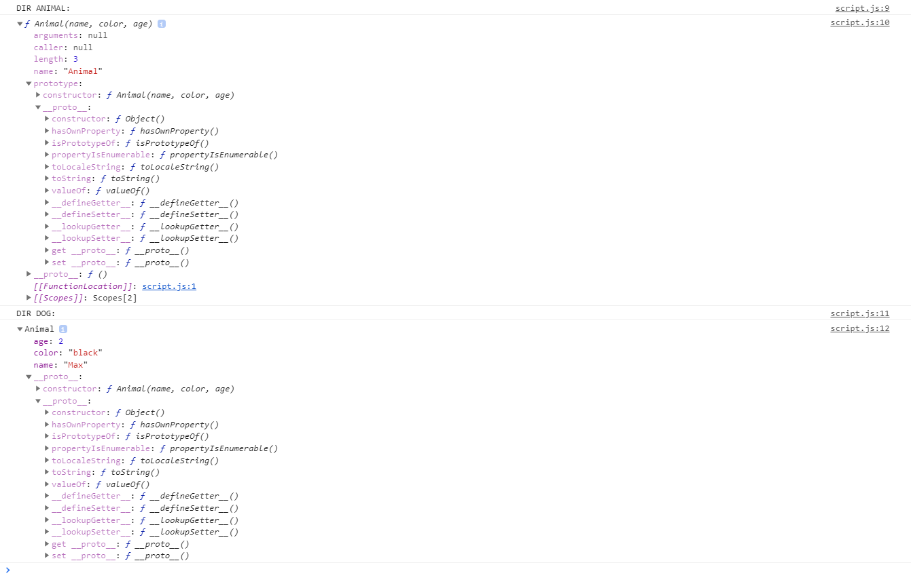
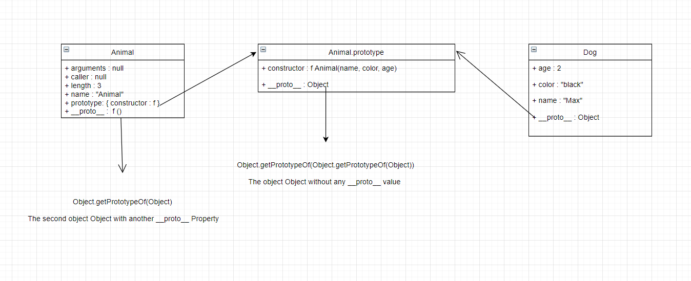
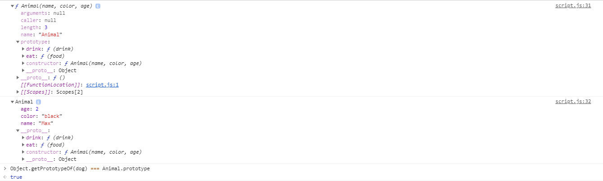
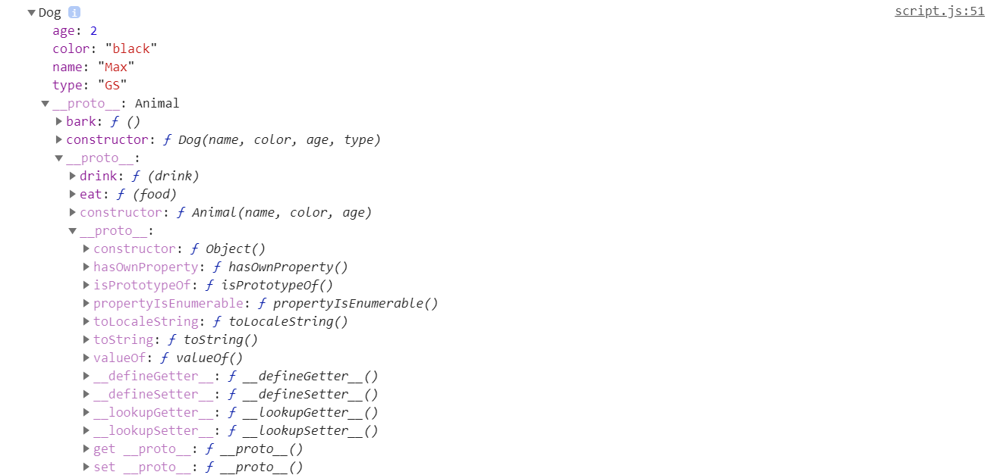
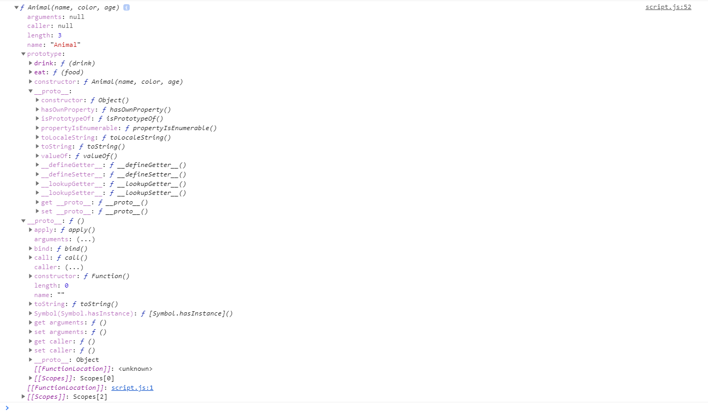
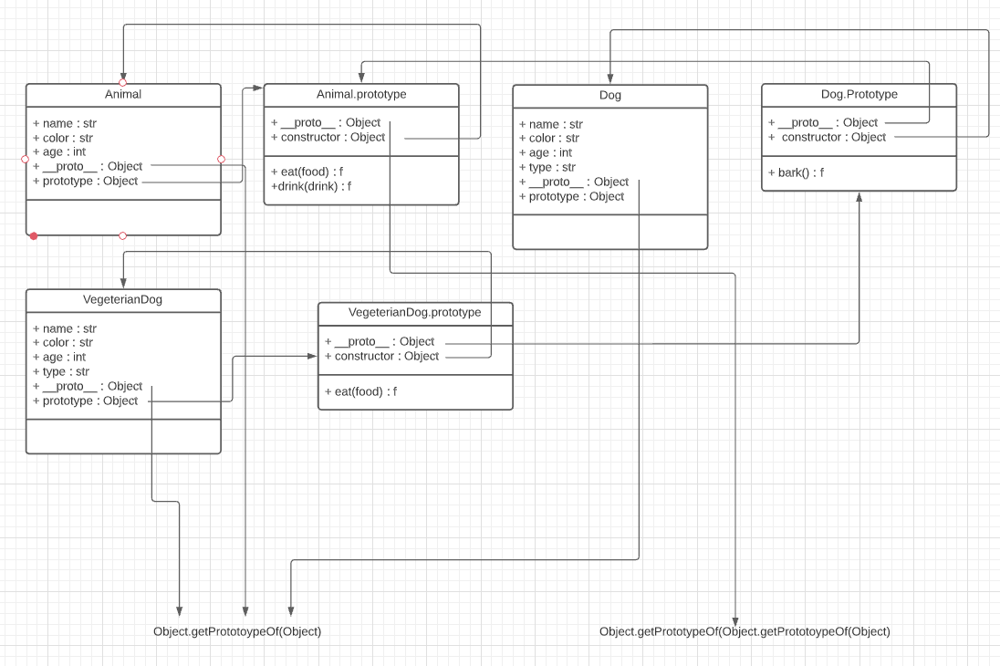
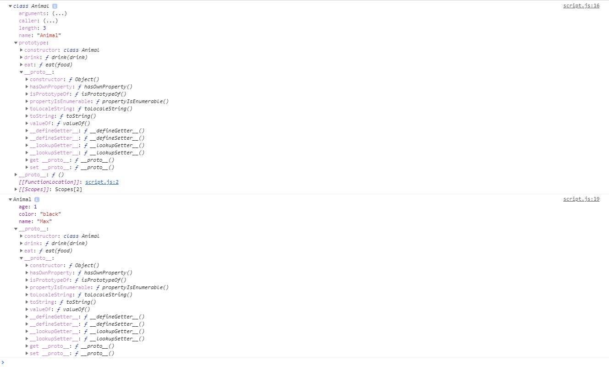
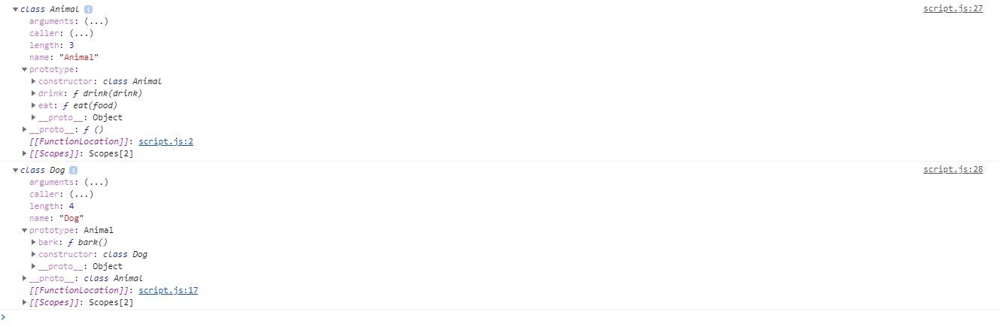
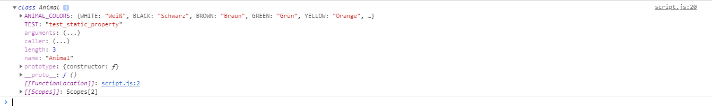

# Object Oriented Programming in JavaScript ( Chapter 13 )
---

## Introduction

Before getting into the details of OOP in JavaScript let's talk about the 4 big concepts of OOP ( AEIP ) :

* ***Abstraction*** [ Abstract behaviour is summarized in different classes and prototypes ]
* ***Encapsulation*** [ Hiding properties and/or methods from the outside using special keywords and setters&getters ]
* ***Inheritance*** [ The child classes that inherit from other parent classes are can use all the methods & properties that are presented in the parent classes ( with exception of some keywords e.g private in C# ) ]
* ***Polymorphism*** [ Objects can be used as other types that they inherit from in different contexts ]  

Before getting into each of those terms we should understand what a class actually represents. 
A class is basically the structure for objects, there is no information in there other than how the methods work and how the properties look like ( in German : 'Bauplan' ). We can have for example the class "Animal" that has the structure of what properties an Animal has ( e.g. a name, age etc. ) and what the Animal is capable of doing ( e.g. eat, drink, etc. ). So this is a class but an object is made from a specific class. Let's say that you've made the class Animal and now you want to have the object Dog, that has specific properties & methods attributed to your dog, with a specific name, age and so on. I will give an example in code using Python since it's easier to see it.

```python
class Animal():
    def __init__(name, age):
        this.name = name
        this.age = age
    def eat(food):
        print(format("I'm eating {0}".format(food)))
    def drink(drink):
        print(format("I'm drinking {0}".format(drink)))
# Now this is the class, it's the structure of what the properties of our Animals look like and what the Animals are capable of doing.

my_dog_max = Animal("Max", 2)
my_dog_max.eat("dog food")
my_dog_max.drink("water")

# Now I have created a dog that has specific properties, like a specific name , 'Max' and a speicific age, 2 years old.
# Animal is the class, my_dog_max is an instance of that class, is an object of that specific type 

```

JavaScript is an object based programming languages. There are no real classes. Instances of objects are made out of other objects and not out of classes like in other programming languagues like for example Java or C# or Python. If object 1 is made out of object 2, we can say in some cases that object 2 is the prototype of object 1 or that the prototype property of object 2 is the prototype of object 1. Because of this principle of 'prototypes' we say that JavaScript is a prototypical programming language or an object-based programming language. We'll get into the details of prototypes later on.

Now we can better understand the big 4 concepts of object oriented programming :

#### ***1. Abstraction***
As I've previously explained, **through abstraction we mean that classes & prototypes represent the structure while objects are more specific entities that are instances of this classes. Objects have specific data filled in the properties that are structured in the class, while the class itself only shows the type of the properties and how they should look like and how they have to function**.

An example of this would be that we've previously made the class "Animal" that had the properties name & age. So the class animal is an abstract structure, nothing that we can actually use. Succeeding we have created the object my_dog_max that is made out of the class Animal, that is an instance of the class Animal. The object my_dog_max has filled in the 'name' & 'age' properties, so it's something more specific, it's not an abstract structure like the class Animal anymore.
Here is a drawing that summarises abstraction


#### ***2. Encapsulation***
**Through the notion of encapsulation or also called, information hiding is meant that we want to hide certain properties from being used outside the object itself. We can only access them using getters and setters.**

Let's take an example. Let's say that you have the Animal class and you have the property age. Since you know that the age of the Animal can't be negative you want to protect that variable from being unintentionally set to a negative integer. In order to do that you use the concept of encapsulation. What this means is that, you set the main property that you want to protect to private so that it is only available inside the class and then make use of setters and getters outside of the class in order to control the input that comes into the property. 
If you set the property age on private and create a setter called set_age for example, that setter will control the input that comes into your private property age in such a way that it will be impossible for you to set the age to a negative integer. You can write the code in such a way that it returns an error when you try to put negative integers into your age property.
Although in JavaScript you don't have keywords like 'private' and 'public', like you have for example in Java or C# you can still use setters and getters.
You can have for example the property age and the setter called set_age and you can write:
```python
my_dog_max.set_age = -5
```
In this case if you've written your setter correctly, the age property will be protected and won't be set to a negative number. If your age property wouldn't have been encapsulated, then mistakes like the following one could have easily happened:
```python
my_dog_max.age = -5
```
In this case, since you directly use the property 'age' without any setter, it won't return any error and the age will be set to a negative integer.

#### ***3. Inheritance***
**Through inheritance all properties and methods will be passed down in all the classes that are made from another class**. So let's say that you have class A with method x and property y. After creating class A you create class B that inherits from class A and has another property called z. In class B you can use all the properties and methods from class A & everything that you add to class B, if they are not private properties or methods. In case that they are protected or public you can use them.

Inheritance represents an 'is-a'-connection. So let's say that the class dog inherits from the class Animal. You can also read that as : dog is - an Animal. 

Inheritance is especially useful when you don't want to repeat methods & properties and in order to structure your code in such a way that it makes sense, like in our previous case with the classes dog & animal. You don't have to repeat yourself and it makes code much more easier to read and understand.

#### ***4. Polymorphism***
**Polymorphism is the ability of classes to be passed down as different types in certain contexts**. Through that statement I mean that for example you have 3 classes :

- Animal
- Dog ( inherited from the upper-class Animal )
- Vegeterian_Dog ( inherited from the upper-class dog)

Let's say that we have a function called *pet(Animal animal_to_pet)*. So the function needs an object of type Animal. 

Through polymorphism we are allowed to pass in the function all objects that are of the specific type asked and all objects that are derived/inherited from that type.

In this case we are allowed to use objects that are of type Dog & Vegeterian_Dog as well even if the type asked is Animal, that is irrelevant.

**Polymorphism only goes down the inheritance-chain, but never up.**
***A vegeterian dog is always a dog. A dog is always an Animal. Not all Animals are dogs. Not all dogs are vegeterian dogs. You can only work with Polymorphism by walking up the chain, never down***

What this means is that if you have the function *pet_dog(Dog dog_to_pet)*, you could pass objects that are of type Vegeterian_Dog since they are derived/inherited from the type Dog, but you can't add objects of type Animal even if the type Dog is inherited from Animal, you can't go up the chain, only down. 

In JavaScript, polymorphism is included by default since there are no 'types', you can put in the argument of a function whatever you want and there will be no errors.

*To be brief, you can't pass arguments whom types are upper-classes of the asked type, you can only pass arguments that have the exact type that is asked or objects that have types inherited from the type asked.* 

#### **JavaScript and Object Orientation** 
In JavaScript, object orientation is not the same as in other languages, like in Java or C# for example. As I've previously said, JavaScript is a prototypical programming language. That means that Objects are build out of other objects, not out of classes.

In JavaScript there are three techniques of working with object orientation:

1. Prototypical Object Orientation [ This is the most pure way of working with oop in JavaScript since this is where you use objects. As previously said JavaScript doesn't know real classes, everything is an object and every object ]
2. Pseudoclassical Object Orientation [ By using this pattern you utilize JavaScript as if it would be a class-based programming language. Here is where you use constructors ]
3. Object Orientation with class syntax [ This pattern is a simple syntatical way of the pseudoclassical object orientation pattern ]

---

## 1. Prototypical Object Orientation
JavaScript doesn't have the so called 'classes' that you would see in a class-based programming language like Java. In JavaScript you only have objects and each object can be used as the parent-object for another object, so we will call the parent-object the prototype of the new inherited object. That is why we call JavaScript a prototoype-based programming language. Every object in JavaScript is made out of another object, except the biggest parent-object that all objects inherit from : the object ***Object***. 
We've previously learned that classes are used as structures for objects. In JavaScript we don't have classes, only objects.
Every object in JavaScript can be used as the structure for another object. So let's say that you have object A and you make object B that made out of object A. Object A will become the prototype of object B. We could translate that into a class-based programming language in creating the sub-class B for the super/parent-class A. 
In JavaScript in order to get the prototype for an object, you can write the name of the object and then use the prototype \_\_proto\_\_ example : object_B.\_\_proto\_\_ will return you object_A since object_B has been made from object_A.

Let's take the following code as an example:
```JavaScript
let Animal= {
    name : "",
    color : "Brown",
    age : 0,
    eat: function(food){
        console.log(`I'm eating ${food}`);
    },
    drink: function(drink){
        console.log(`I'm drinking ${drink}`);
    }
}

let Dog = Object.create(Animal);
Dog.bark = function(){
    console.log("Bark !");
}

let Cat = Object.create(Animal);
Cat.Meow = function(){
    console.log("Meow !");
}

let VegeterianDog = Object.create(Dog);
VegeterianDog.eat = function(food){
    if(food === "meat"){
        console.log("I don't eat meat.");
    }else{
        Object.getPrototypeOf(VegeterianDog).call(this, food);
    }
}
```

I will draw a short diagram so we can understand the code better:


**Important note for the sketch**: As I've already drew in the sketch, Animal inherits from the object Object, the object in JavaScript that has no prototype ( no \_\_proto\_\_ property ), it doesn't inherit from anything. If you write in the console Animal.\_\_proto\_\_ === Object, you will get 'False', since it returns another object with the name Object that still has a prototype. In order to get the parent object Object that has no prototype and that is the prototype of every made object, you have to get the prototype of the given object Object 2 times. So you need to write Object.getPrototypeOf(Object), which will give you another object Object that still has a prototype, and then you have to write Object.getPrototypeOf() again, so Object.getPrototypeOf(Object.getPrototypeOf(Object)).

This is how the object Object works and looks like. As previously mentioned, every object made in JavaScript has a prototype, that being the object Object, the object Object that has no prototype ( no \_\_proto\_\_ property).


After you inherit the object Dog from the object Animal, you can add other properties & methods to your object Dog. In the object VegeterianDog we see that it is even possible to override methods & properties, so we are completly free and flexible when it comes to inheritance. 
Now, **besides the properties & methods that we add to an object, there is always one property that is automatically added, that is the property \_\_proto\_\_ that defines the property of the specific object**. 
This is how \_\_proto\_\_ works:

```JavaScript
console.log(Object.getPrototypeOf(Animal) === Object.getPrototypeOf(Object.getPrototypeOf(Object))); // True
console.log(Object.getPrototypeOf(Dog) === Animal); // True
console.log(Object.getPrototypeOf(Cat) === Animal); // True
console.log(Object.getPrototypeOf(VegeterianDog) === Dog); // True

console.log(Object.getPrototypeOf(Dog) === Cat); // False
```

We can see from the code that for example the object VegeterianDog is made from Dog, so Dog is the prototype of VegeterianDog. Dog is made from Animal, so Animal is the prototype of Dog. In JavaScript each object is the prototype of other object, and the prototype of that object has another prototype from another object and so on, until we reach the object Object that has no prototype. This is what we call the **prototype chain**. The objects that are up on the prototype chain are more abstract, the ones that are down are more special.

***This is why the prototype chain is so useful:***
Let's say that you want to use the method "drink" in VegeterianDog so you write 

```JavaScript 
VegeterianDog.drink()
```

JavaScript will now go in the object VegeterianDog and will see that you don't have any method called 'drink', so it will go in the prototype of the object VegeterianDog, which is Dog. JavaScript will see that there is such method called 'drink' in Dog either, so it will go in the prototype of Dog, that is Animal. In Animal, JavaScript will see the method "drink" and will execute it. This is how the prototype chain is used in JavaScript. Let's say that you would want to use a method called 'isPrototypeOf', JavaScript will go from Dog up to Animal and won't find that method. Afterwards, it will go as usual in the prototype of Animal, which is the object Object that has no prototype and will find that method. If you execute a method that doesn't exist in any of the prototypes JavaScript will return an error ( TypeError ) since it will go from the object that you've called the method from up until the object Object and won't find it, so it will return an error.

***Summarized***
In JavaScript we don't have classes, we only have objects that can be used as structures for other classes and that's why we call JavaScript a prototypical-based programming language. Because we can use objects as structures for other objects that would translate in a class-based programming language like Java into creating a sub-class from a parent-class. 
Let's say that we have object A and object B and object B has been made from object A. Object A will become the prototype of object B. Every object in JavaScript has a prototype, except for example the object Object that has no prototype and all objects are made out of this parent-object, the object Object. In our example, object A will be the prototype of object B and the ***object Object*** will be the prototype of object A. 
Just because you have created an object B out of object A that doesn't mean that you can't add anything to object B that differs from object A. You are allowed to add new properties, methods and even override existing methods.
Every object has a prototype and the prototype of every object has another prototype until it reaches the object Object. This is also called the prototype chain.
The prototype chain is useful for JavaScript since it bounces from the object where a method or property is called from its prototype to the prototypes of previous prototypes until it reaches to object Object in order to find the specific method or property. So if you execute a method in object B, JavaScript goes to search for that method in object B, if it doesn't find the method it jumps in the prototype of object B, object A. If it doesn't find the object A, it jumps into the object Object. If it doesn't find that method in the object Object either, it will just raise a TypeError.
Note: if you write 'console.dir(Object)' in the console you won't get the parent object Object that has no prototype, you will get an object Object that has another prototype. The prototype of the given object Object has another prototype the original parent object Object without any prototype. So in order to get the object Object you have to get the prototype 2 times -> Object.getPrototypeOf(Object.getPrototypeOf(Object)).


---

## 2. Pseudoclassical Object Orientation

In pseudoclassical object orientation we use normal functions as we use classes in class based programming languages, almost the same, with slight differences. We use normal functions that we call then call *constructor functions* by adding the keyword *new* to them. Example :

```JavaScript
function Animal(name, color, age){
    this.name = name;
    this.color = color;
    this.age = age;
}

let dog = new Animal("Max", "black", 2);
```

We can see from the code that we have to use ***this*** when writing a property from the constructor. 
If we console.dir Animal we can see that the \_\_proto\_\_ in this case isn't like in prototypical object orientation, the object Object without any prototype, but it's the second object Object, the one with a prototype ( with a \_\_proto\_\_ property ). On top of that it has a ***prototype*** property. To summarize : ***\_\_proto\_\_*** is the prototype of the object meaning that, it's the prototype property of the object that it has been made from, in this case it is Object.getProtypeOf(Object) and ***prototype*** is what comes inside all other objects that are made from current object. 
***In pseudoclassical object orientation if you build an object from a constructor function, it will inherit everything that is in the constructor && in the prototype property of the constructor function. The prototype and \_\_proto\_\_ properties of the constructor function are objects themselves.***
This is how the constructor function Animal and the object 'Dog' made out of it look like : 



From the screenshot we can see that Dog gets the normal properties from the constructor, so age, color and name and on top of that it has the \_\_proto\_\_ property that is another objects itself and that is the same as Animal.prototype. So Object.getPrototypeOf(Dog) === Animal.prototype. 

In Animal.prototype we can see 2 other properties : constructor and \_\_proto\_\_. \_\_proto\_\_ in this case is the object Object without any other prototype, so the parent object Object. It also has the property constructor which if we look into we will see that it is the object itself again, so, Animal. I will get into this specific property later, its usecases and why it's needed.

So, to summarize : In pseudoclassical oop we use normal functions as 'classes' and we call them 'constructor functions' by adding the keyword 'new' when we make an object out of them. Any constructor function has the properties arguments, caller, length and name and it has 2 other properties called **prototype** and **\_\_proto\_\_** and they are both objects themselves. The **prototype** property will be the \_\_proto\_\_ property of all objects that will be made from the constructor function. So the prototype of the objects that are made from the constructor function will be the prototype property of the constructor function. The prototype property has 2 other properties that are also objects themselves : constructor, which will be further explained and another \_\_proto\_\_ property which is the object Object without any other proto. The property **\_\_proto\_\_** of the constructor function is the second object Object with another \_\_proto\_\_ property so it's Object.getPrototypeOf(Object). If we would look at a diagram of a constructor function and it's object it would look like this:



Until now we have only worked with normal properties and explained how the prototype chain between constructor function & object works. There are 2 ways only when it comes to writing methods in Pseudoclassical OOP using constructor functions.
You either :

* Write the methods inside the constructor function ( *wrong* )
* Write the methods inside the prototype of the constructor function ( *right* )

Writing the methods inside the constructor function has the same effect as writing them inside the prototype of the constructor function. 
The reason why you should never write methods inside the constructor function directly is that it makes everything slower. Every time you make an new instance of the new object, the methods will be created again for each instance.
On the other side, writing the methods in the prototype of the constructor function makes everything faster. On top of everything being faster, thinking about the prototype chain it makes things easier to follow and to structure.

This is how writing methods works ( as we've already said, we write methods in the prototype property only ):

```JavaScript
function Animal(name, color, age){
	this.name = name;
	this.color = color;
	this.age = age;
}

Object.defineProperties(
	Animal.prototype,
	{
		eat : {
			value : function(food){
				console.log(`I'm eating ${food}`);
			},
			writable : false,
			enumerable : true,
			configurable : false
		},
		drink : {
			value : function(drink){
				console.log(`I'm drinking ${drink}`);
			},
			writable : false,
			enumerable : true,
			configurable : false
		}
	}
);

let dog = new Animal("Max", "black", 2);

dog.eat("meat"); // Output in console : "I'm eating meat"
dog.drink("water"); // Output in console : "I'm drinking drink"
```

We've added 2 methods, eat and drink, inside the prototype property of the constructor function. Now we can see that the \_\_proto\_\_ of the object dog will have the 2 basic properties that are always there, \_\_proto\_\_ and constructor and on top of that it will have 2 other methods : eat && drink. 
Now JavaScript can easily use the prototype chain. Let's say that you write dog.eat("meat"), JavaScript will go inside dog and it won't see any method called 'eat', it will only have 3 properties ( name, age and color ) and the property \_\_proto\_\_. JavaScript will go inside \_\_proto\_\_ where it will finally find the method 'eat'.
This is an overview of the prototype chain and where the methods are placed: 



Now that we know how the constructor function and instances made out of it works, how to build methods and how the prototypes work we can now go through how inheritance works in pseudoclassical oop.

When it comes to inheritance, it is much more different than what we have seen in prototypical object orientation. 
In order to inherit in pseudoclassical oop you have to follow this steps:

1. Build your constructor function with all the properties
2. Inside the constructor function call ( using **apply** or **call**) the function that you want to inherit from. Eventually if any other arguments repeat you can add them inside the **apply** or **call** function so you don't waste space.
3. Modify the prototype of the constructor function by building it as a **new empty object with the \_\_proto\_\_ property set to the prototype property of the constructor function that you want to inherit from**
4. Set another property to the prototype property of the constructor function : the **constructor** property as being 

So, let's say that you want to make a constructor function 'Dog' that inherits from the class Animal:

```JavaScript
function Dog(name, color, age, type){
    Animal.apply(this, [name, color, age]);
    this.type = type;
}

Dog.prototype = Object.create(Animal.prototype);
Dog.prototype.constructor = Dog;

Object.defineProperty(
	Dog.prototype,
	"bark",
	{
		value : function(){
			console.log("bark");
		},
		writable : false,
		enumerable : true,
		configurable : false
	}
);

let Max = new Dog("Max", "black", 2, "GS");
console.dir(Max);
console.dir(Animal);
```

We have made a new constructor function Dog that inherit from Animal. The parameterst from the constructor function are the same as in Animal with one single addition : type. We call the Animal function and apply it's constructor to our constructor by giving it the arguments name, color & age. What this does, it helps you spare space because you don't have to write this\.name = name, this.color = color etc. for each argument which is really helpful and it makes sure that nothing is left behind. Let's say that you have a list called *edible_foods* in Animal that is not written with **this**, so it's not *this.edible_foods*. If you wouldn't call the Animal constructor function inside the Dog constructor function, you wouldn't have that list in Dog, later I'm going to explain this in detail.
After that we re-build the prototype of Dog. We build a new empty object in the prototype of Dog that has as *\_\_proto\_\_* the prototype property of Animal and set the constructor of the empty object to be Dog, later why.
Afterwise, as I have previously said, we can add functions inside the prototype of Dog.
If we console.dir a dog object and the constructor function animal we get this:

***Max:***

***Animal:***


You can clearly see how the prototype chain works. Max.\_\_proto\_\_ is  Animal.prototype.

Now let's get into the details.

*Here are the following reasons why the constructor property is very important:*

* It is used in promises
* You can use it in order to clone an object easily without any mistakes
* Let's say that you have the constructor function Person and you're building another constructor function Student that inherits from Person, so you write Student.prototype = Object.create(Person.prototype) now, if you don't write Student.prototype.constructor = Student, if you later want to for example clone the constructor function Student by using the constructor property, Student.constructor will automatically point to Person, which is wrong. The property constructor of Student **must** point to Student otherwise it's misleading.

*Why should you apply/call the constructor of the constructor function that you want to inherit from:*

Let's take in consideration the following example:

```JavaScript
function Animal(){
	edible_foods = ["meat"];
}
function Dog(name, age){
	this.name = name;
	this.age = age;
}

Dog.prototype = Object.create(Animal.prototype);
Dog.prototype.constructor = Dog;
```

As you can see we haven't called the Animal constructor inside our constructor function. Here's what will happen if we try to call the edible_foods array:

```JavaScript
let x = new Dog("Max", 2);
console.log(x.edible_foods); // error
```

We can an error, since Dog doesn't see the array. This is how we should have written the Dog constructor:

```JavaScript
function Dog(name, age){
	Animal.call(this);

	this.name = name;
	this.age = age;
}
```

Now, if we try to call the x.edible_foods array, we won't get an error, we would get the actual needed array.
On top of that, calling the constructor of the constructor function that we want to inherit also helps us a lot with saving space which helps us read things easier. Here's an example:

```JavaScript
function Animal(name, color, age){
	this.name = name;
	this.color = color;
	this.age = age;
}

function Dog(name, color, age, type){
	Animal.call(this, name, color, age);
	/*
	We write Animal.call(this, name, color, age) instead of:

	this.name = name;
	this.color = color;
	this.age = age;

	Which saves us a lot of space
	*/
	this.type = type;
};
```

**So that's why you have to call the parent constructor function every time, regardless if you have any arguments to call it with or not.**

The next detail is the following. Is it ok to change the prototype of a child constructor function to be an instance out of the parent constructor function and not an empty object that has the parent constructor function's prototype property as the \_\_proto\_\_ property? So shortly said:

```JavaScript
function Employee(){} // parent constructor function
function Consultant(){} // child constructor function

// Is is the same ?
Consultant.prototype = new Employee();
// OR:
Consultant.prototype = Object.create(Employee.prototype);
```

It's not the same and this is the best way to do it:

```JavaScript
Consultant.prototype = Object.create(Employee.prototype);
```

Why ? Here is a short example:

```JavaScript
function Employee(){
	this.staff = new Array();
}

function Consultant(name){
	this.name = name;
}

Consultant.prototype = new Employee(); // ***WRONG*** //
Consultant.prototype.constructor = Consultant;

let x = new Consultant();
let y = new Consultant();

x.staff.push("A");
x.staff.push("B");

console.log(x.staff); // ["A", "B"]
console.log(y.staff); // ["A", "B"]

y.staff.push("C");
y.staff.push("D");

console.log(x.staff); // ["A", "B", "C", "D"]
console.log(y.staff); // ["A", "B", "C", "D"]
```

Basically, as you can see, each time you access the *staff* array you basically access the same array all the time since the prototype is an object. If you want to fix this, just call the parent constructor function, Employee,  in the Consultant. Even then it is still recommended to not mix up things and let the prototype be an empty object with the \_\_proto\_\_ property being the prototype of the parent constructor function so you don't break the prototype chain and let it clean. So, this is the right way:

```JavaScript
Consultant.prototype = Object.create(Employee.prototype); // ***THE RIGHT WAY*** //
```

In the end of this sub chapter we will finish with a bigger example and a scheme of how the prototype chain works in the following example:

```JavaScript
function Animal(name, color, age){
	this.name = name;
	this.color = color;
	this.age = age;
}

Object.defineProperties(
	Animal.prototype,
	{
		eat: {
			value : function(food){
				console.log(`I'm eating ${food}`);
			},
			writable : false,
			enumerable : true,
			configurable : false
		},
		drink: {
			value : function(drink){
				console.log(`I'm drinking ${drink}`);
			},
			writable : false,
			enumerable : true,
			configurable : false
		}
	}
);

function Dog(name, color, age, type){
	Animal.apply(this, [name, color, age]);
	this.type = type;
}

Dog.prototype = Object.create(Animal.prototype);
Dog.prototype.constructor = Dog;

Object.defineProperty(
	Dog.prototype,
	"bark",
	{
		value : function(){
			console.log("Bark.");
		},
		writable : false,
		enumerable : true,
		configurable : false
	}	
);

function VegeterianDog(name, color, age, type){
	Dog.apply(this, [name, color, age, type]);
}

VegeterianDog.prototype = Object.create(Dog.prototype);
VegeterianDog.prototype.constructor = VegeterianDog;

Object.defineProperty(
	VegeterianDog.prototype,
	"eat",
	{
		value : function(food){
			food === "meat" ? console.log("I'm not eating meat") : Animal.prototype.eat.call(this, food);
		},
		writable : false,
		enumerable : true,
		configruable : false
	}
);
```



## 3. OOP with class syntax

OOP with class syntax has the same idea behind as the pseudoclassical oop but it has some syntactic sugar to make things easier. 
This is for example how to build a basic 'class':

```JavaScript
class Animal{
	constructor(name, color, age){
		this.name = name;
		this.color = color;
		this.age = age;
	}

	eat(food){
		console.log(`I'm eating ${food}`);
	}
	drink(drink){
		console.log(`I'm drinking ${drink}`);
	}
}
```

The methods go all automatically inside the prototype property of the class Animal.



You can see that Max.\_\_proto\_\_ is the same things as Animal.prototype and Animal.\_\_proto\_\_ is Object.getPrototypeOf(Object) is the same thing as pseudoclassical oop.

You can easily use getters and setters, too:

```JavaScript
class Animal{
	constructor(name, color, age){
		this._name = name;
		this._color = color;
		this._age = age;
	}

	get name(){
		return this._name;
	}
	set name(name){
		this._name = name;
	}

	get color(){
		return this._color;
	}
	set color(color){
		this._color = color;
	}

	get age(){
		return this._age;
	}
	set age(age){
		this._age = age;
	}

	eat(food){
		console.log(`I'm eating ${food}`);
	}
	drink(drink){
		console.log(`I'm drinking ${drink}`);
	}
}
```

It is much more easier to build a sub-class. Everything will be set automatically so the methods will be in the prototype, the sub-class will have a prototype object with the \_\_proto\_\_ property set to be the upper-classe's prototype property and so on. You can do all that by using the keyword ***extends*** and you can call the upper-class by using the keyword ***super***:

```JavaScript
class Animal{
	constructor(name, color, age){
		this.name = name;
		this.color = color;
		this.age = age;
	}

	eat(food){
		console.log(`I'm eating ${food}`);
	}
	drink(drink){
		console.log(`I'm drinking ${drink}`);
	}
}

class Dog extends Animal{
	constructor(name, color, age, type){
		super(name, color, age);
		this.type = type;
	}

	bark(){
		console.log("Bark.");
	}
}

let Max = new Dog("Max", "black", 2, "GR");
console.log(Max.name); // Max
console.log(Max.color); // black
console.log(Max.age); // 2
console.log(Max.type); // GR

Max.eat("meat"); // I'm eating meat
Max.drink("water"); // I'm drinking water
Max.bark(); // Bark.
```

If we dir Dog & Animal you can see that everything is set automatically:



You can also call methods from the upper-class:

```JavaScript
class VegeterianDog extends Dog{
    constructor(name, color, age, type){
        super(name, color, age, type);
    }
    eat(food){
        if(food instanceof Meat){
            console.log("I don't eat meat.");
        }else{
            super.eat(food);
        }
    }
}
```

When using class syntax it is very easy to build static methods & properties:

This is how you define a static methods
```JavaScript
class Animal{
    constructor(name, color, age){
        this._name = name;
        this._color = color;
        this._age = age;
    }
    static getAnimalColors(){
        return {
            WHITE : "Weiß",
            BLACK : "Schwarz",
            BROWN : "Braun",
            GREEN : "Grün",
            YELLOW: "Orange",
            ORANGE: "Orange"
        }
    }
}

console.log(Animal.getAnimalColors());
```

Static properties on the other side have to be build outside of the class

```JavaScript
class Animal{
    constructor(name, color, age){
        this._name = name;
        this._color = color;
        this._age = age;
    }
}

Animal.ANIMAL_COLORS = {
    WHITE : "Weiß",
    BLACK : "Schwarz",
    BROWN : "Braun",
    GREEN : "Grün",
    YELLOW: "Orange",
    ORANGE: "Orange"
}
```

Unlike methods & properties that are not static, they are saved on the **'class'** itself, not on the prototype property. Here is an example:

```JavaScript
class Animal{
	constructor(name, color, age){
		this.name = name;
		this.color = color;
		this.age = age;
	}

	static ANIMAL_COLORS = {
	    WHITE : "Weiß",
	    BLACK : "Schwarz",
	    BROWN : "Braun",
	    GREEN : "Grün",
	    YELLOW: "Orange",
	    ORANGE: "Orange"	
	}
}

Animal.TEST = "test_static_property";

console.dir(Animal);
```

